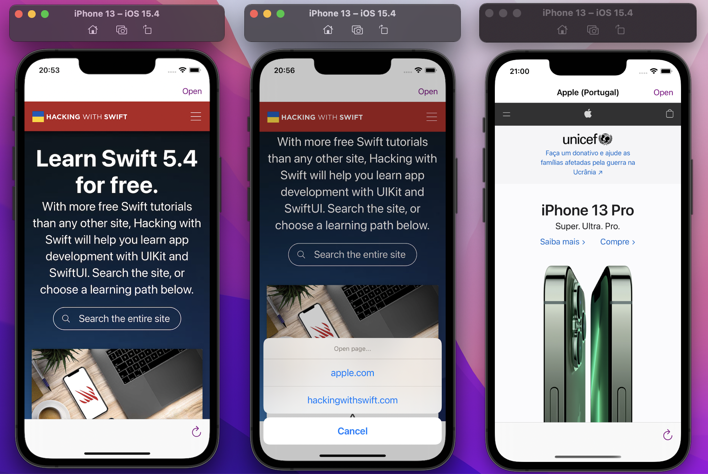

# WebBrowser
This project I created a simple browser with WKWebView, the view open a website that I choose.

## The project
I used a toolbarItems to appear some buttons like progress bar, spacer and refresh. I used removeLast() and append() in toolbarItems and isHidden was used to appear or not refresh button when it were clicked.

The rightBarButtonItem was used an alertController with some addAction, like open other website or cancel the action.

This project has allowsBackForwardNavigationGestures, so allows users to swipe from the left or right edge to move backward or forward in their web browsing.

**Learning about: UIView, WKWebView, UIToolbar, UIProgressView, UIAlertController and more.**

## How to run
Clone this repository and open using XCode.

---
*This project was developed during the study.*
